# DeskFortress.Core Diagrams

## 1. High-Level Architecture Flow

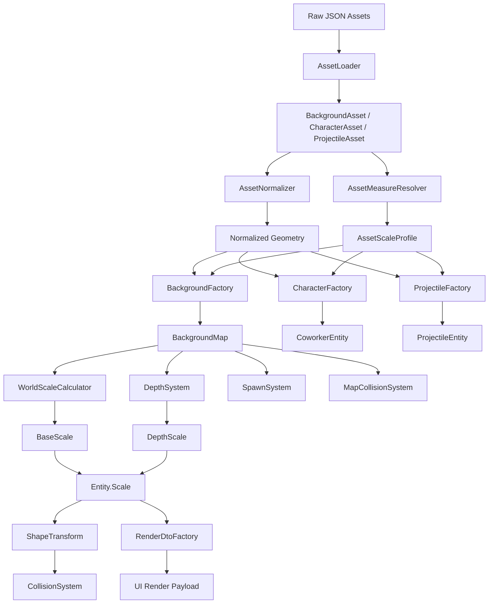

## 2. Scale Resolution Flow

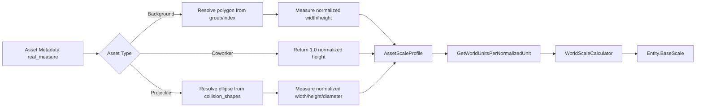

## 3. Runtime Update Flow

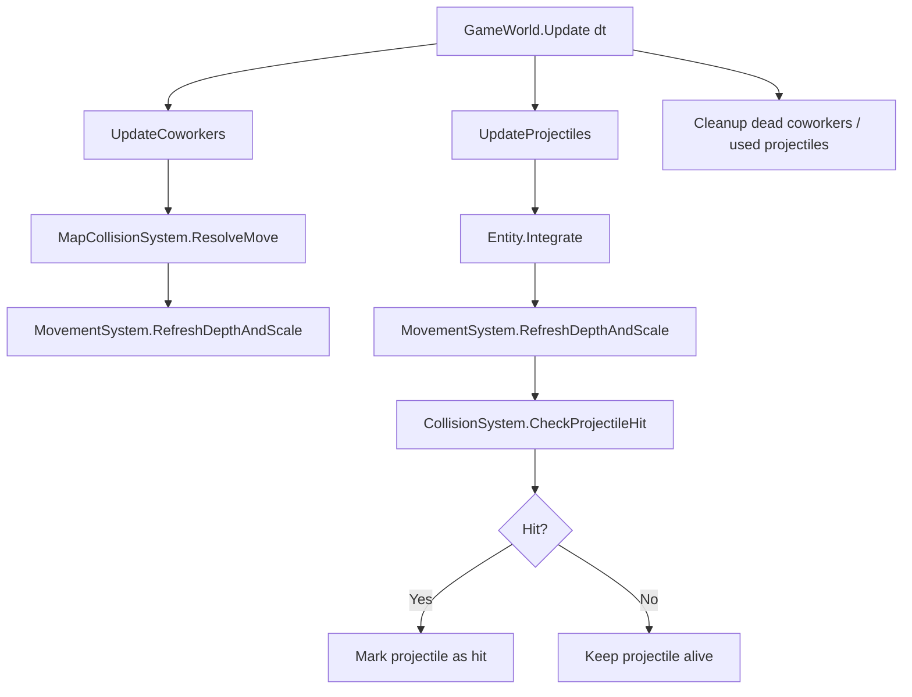

## 4. Package / Module Overview

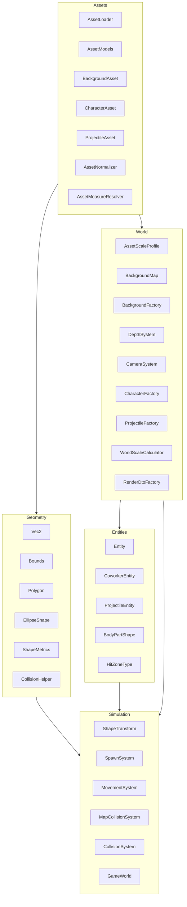

## 5. Core Class Diagram

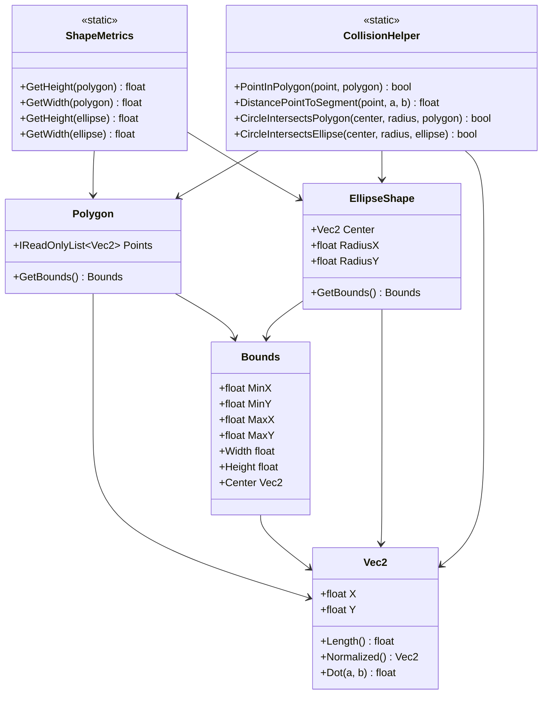

## 6. Asset and World Class Diagram

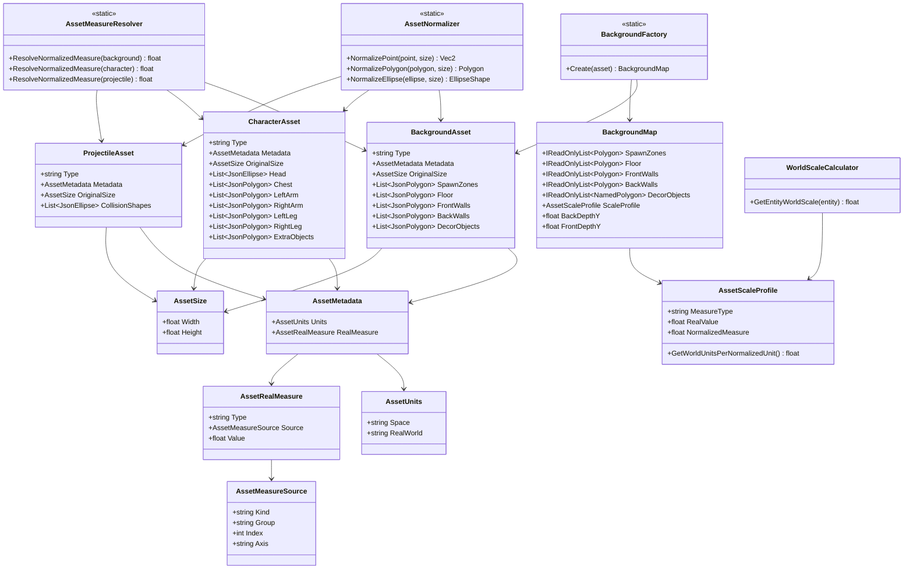

## 7. Entity and Simulation Class Diagram

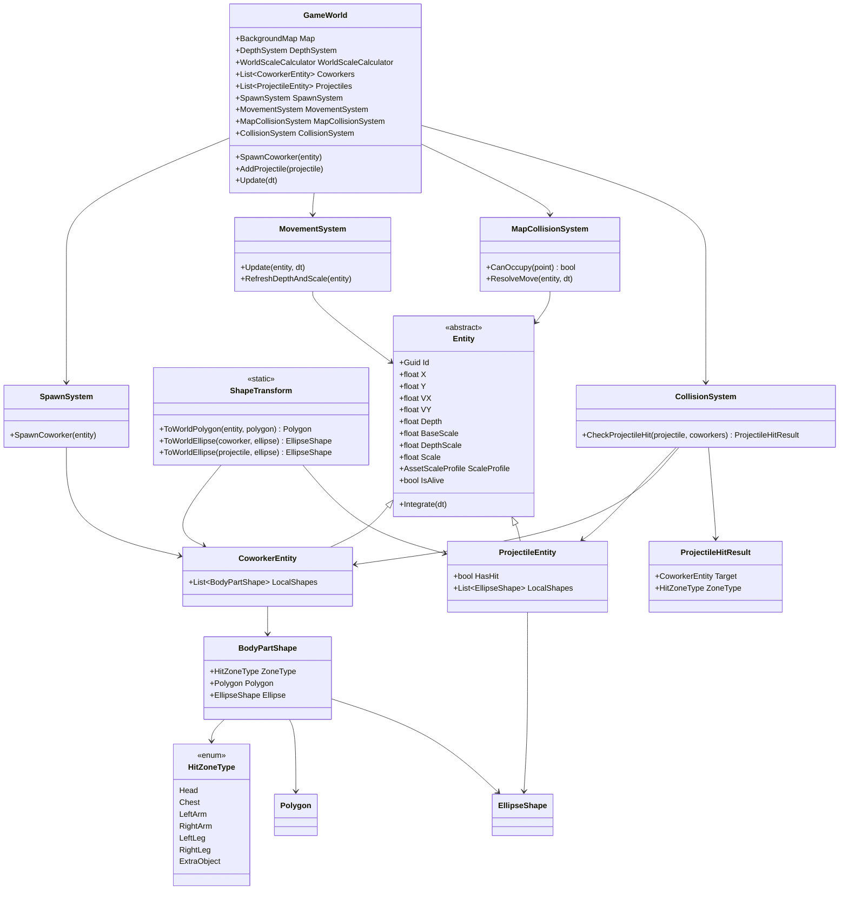

## 8. Asset Loading Sequence

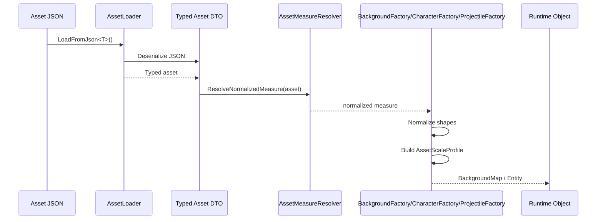

## 9. Coworker Spawn Sequence

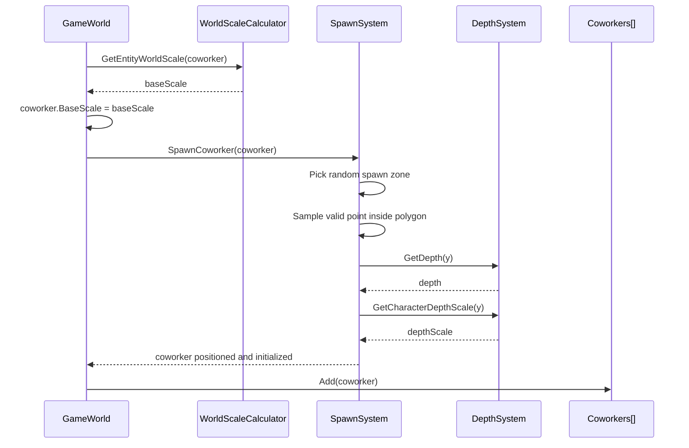

## 10. Projectile Hit Sequence

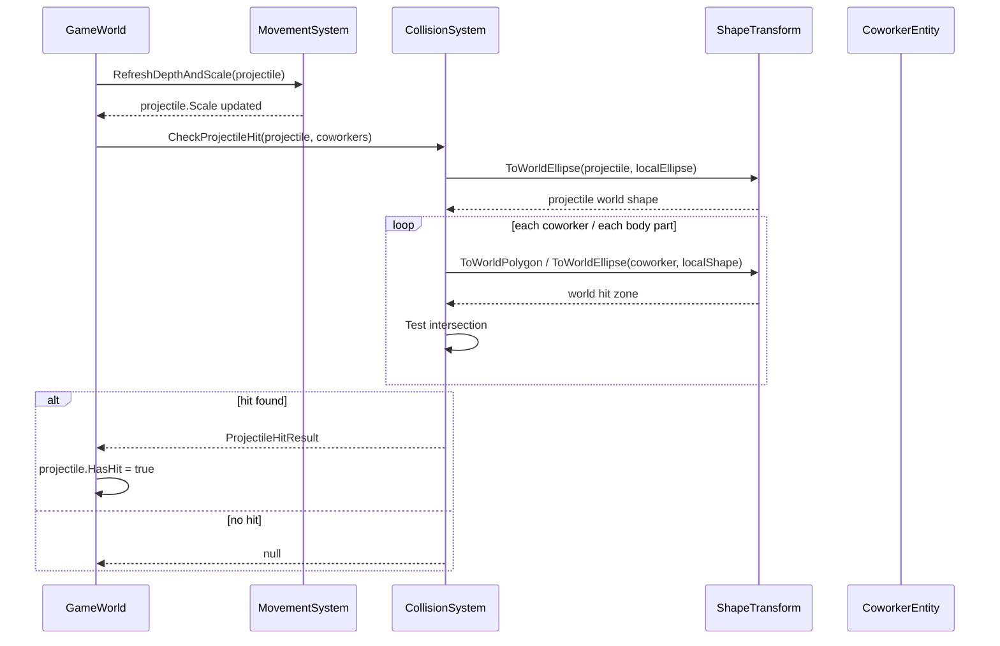

## 11. UI Boundary Flow

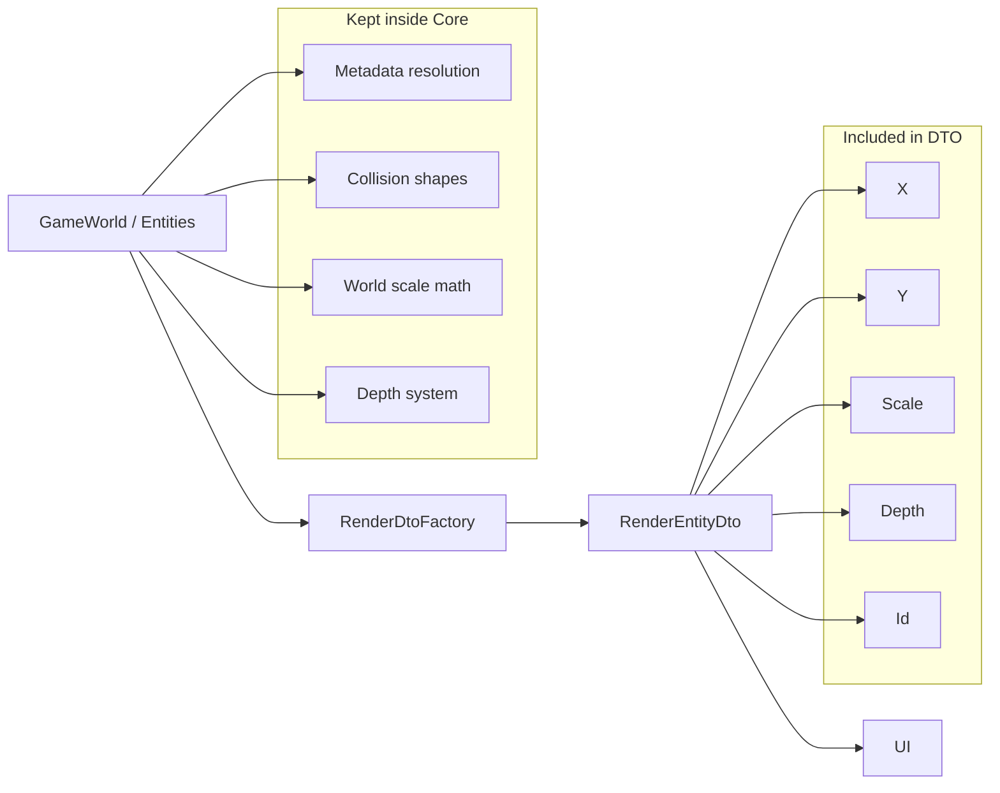

## 12. Recommended Reading Order

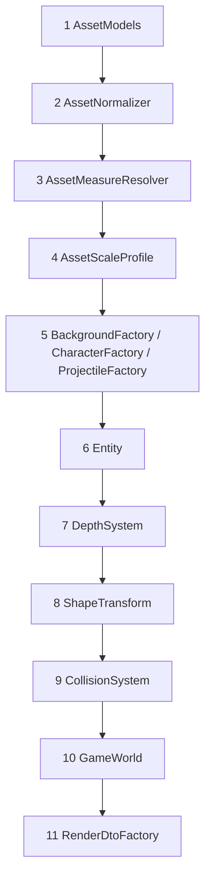

## 13. Notes

- `BackgroundAsset` defines the world reference scale.
- `CharacterAsset` uses the invariant: full asset height = full character height.
- `ProjectileAsset` uses collision geometry as its physical size source.
- `BaseScale` handles real-world proportion.
- `DepthScale` handles perspective.
- `Entity.Scale = BaseScale * DepthScale` is the critical alignment rule for both rendering and collision.
- The UI receives only minimal render payloads and does not need asset metadata or geometry logic.